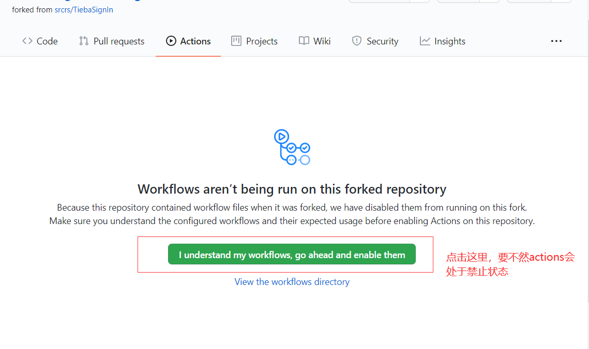

# for test
# CrossHustWall
> 由于疫情的原因，华科实行了半封闭管理，即外出校门申报制度，然而每次申报的有效期仅为一天，对于需要每天外出的同学手续稍显繁琐，因此有了本项目，基本原理是利用`github action`来实现自动申报，本脚本默认申报时间是一天两次（避免失败），早十点和晚十点，默认理由是“吃饭”。需要修改的同学自行修改即可。

> **注意**： 本项目仅用作技术交流，本人不对使用本脚本所产生的任何后果负责，请使用者学习原理后自行删除。

# 用法

## 1. 将本仓库fork

## 2. 添加仓库的Secrets

`USERNAME` 处填写学号，`PASSWORD`处填写你统一身份认证的密码

## 3.  启用action

